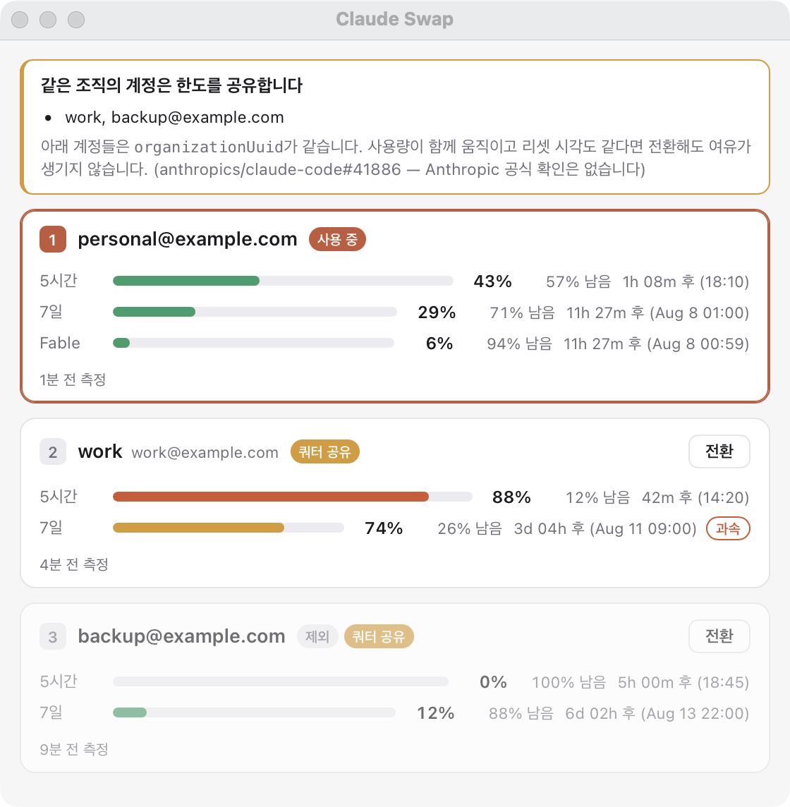

# cswap-dashboard

A macOS menu bar item and window dashboard for
[claude-swap](https://github.com/realiti4/claude-swap): every Claude Code
account's 5-hour and weekly usage, how much is left, and when each window
resets — in one glance.



## What it is

`claude-swap` already does the hard part: it manages multiple Claude Code
logins, tracks usage per account inside a rate-limit-aware polling budget, and
switches between them. It ships a CLI, a TUI, and a menu bar item.

This is a different front end for the same data — a real window, sized for
reading several accounts at once, with a bar per usage window rather than a
line of percentages. It shells out to `cswap ... --json` and renders the
result; it never imports `claude_swap`, never touches your credentials, and
never talks to Anthropic's API itself. Upstream can move without breaking it,
and there is no second polling loop competing for the same rate-limit budget.

## Install

Requires macOS 12+ and Python 3.12+.

**1. Install claude-swap and register an account**

```bash
uv tool install claude-swap
```

Log into Claude Code with each account in turn, running `cswap add` after each
one. Check it worked:

```bash
cswap list
```

**2. Install the dashboard**

```bash
uv tool install git+https://github.com/needitem/claude-swap-mac
```

**3. Build the app bundle**

```bash
git clone https://github.com/needitem/claude-swap-mac
cd claude-swap-mac
./build_app.sh
```

That writes `/Applications/Claude Swap.app` (pass a different directory as the
first argument to put it elsewhere). Launch it from Spotlight or Finder — a
**⇄** appears in the menu bar. Click it → **대시보드 열기**.

To run without the bundle, just run `cswap-dashboard` in a terminal.

### Start it at login

```bash
osascript -e 'tell application "System Events" to make login item at end with properties {path:"/Applications/Claude Swap.app", hidden:true}'
```

## What it shows

Per account, one card:

| | |
|---|---|
| **5시간** | rolling 5-hour window — used %, remaining %, time to reset |
| **7일** | weekly window, same |
| per-model | any per-model weekly limit the account has (e.g. Fable) |

Bars are coloured by how much room is left — green under 60%, amber to 85%,
orange past that, red at the limit — so the colour answers "can I keep working
here?" before you read a number.

A **과속** chip on a weekly window means usage is meaningfully ahead of an even
burn rate for the week: on pace to run out before it resets. `claude-swap`
suppresses this for the first day after a reset, when the comparison is
meaningless.

The active account is outlined. Any other account gets a **전환** button; it
runs `cswap switch N` and repaints. Accounts held out of rotation with
`cswap disable` are dimmed and marked **제외**.

Numbers refresh every 60 seconds, and whenever you open the window or switch.
A failed poll leaves the last good reading on screen rather than blanking it —
`claude-swap` serves usage from a cache with an age, so a brief network blip
should not erase a dashboard that was right a minute ago.

## How the .app works

The bundle is a shell launcher, not a frozen Python app — it finds
`cswap-dashboard` on disk and starts it. One detail is load-bearing:

> The launcher must **not** `exec` the command, and must not leave it as its
> child. It runs `"$APP_BIN" & disown`.

The binary that actually runs the GUI is the uv/pipx venv's `python`, which
lives outside the bundle. If that process inherits the bundle's LaunchServices
registration, macOS 26 accepts its `NSStatusItem` over XPC and then **never
draws it** — the menu bar item silently does not appear, and nothing shows up
in any log. Unsetting `__CFBundleIdentifier` does not help; LaunchServices
makes the association at exec time, not through the environment. Orphaning the
process makes it register with the WindowServer on its own, exactly as running
the command in a terminal does.

Measured on macOS 26.5.1: exec'd from the bundle → no icon; orphaned → icon.

Startup output goes to `~/.claude-swap-backup/menubar-app.log`. After editing
anything inside the bundle, re-sign it:

```bash
codesign --force --sign - "/Applications/Claude Swap.app"
```

## Development

```bash
git clone https://github.com/needitem/claude-swap-mac
cd claude-swap-mac
uv tool install --editable .   # `git pull` now updates the installed command
cswap-dashboard
```

Run against a fixture instead of your real accounts — an active account with a
per-model window, one nearly out of 5-hour quota and ahead of its weekly pace,
and one held out of rotation:

```bash
CSWAP_DASHBOARD_DEMO=1 cswap-dashboard
```

That is also how the screenshot above was taken, so it carries no real email.

`render.py` is pure — it turns a `cswap list --json` payload into HTML with no
AppKit and no subprocess involved, so you can iterate on the layout in a
browser:

```bash
python3 -c "import sys; sys.path.insert(0,'src'); from cswap_dashboard import cswap, render; open('/tmp/preview.html','w').write(render.render(cswap.DEMO))" && open /tmp/preview.html
```

```bash
uv run --with pytest pytest -q
```

## Relationship to claude-swap

Separate project, not a fork. All account handling, credential storage, usage
polling and switching belongs to
[realiti4/claude-swap](https://github.com/realiti4/claude-swap) (MIT) — this
repo contains only the macOS front end and the bundle build.

## License

MIT
